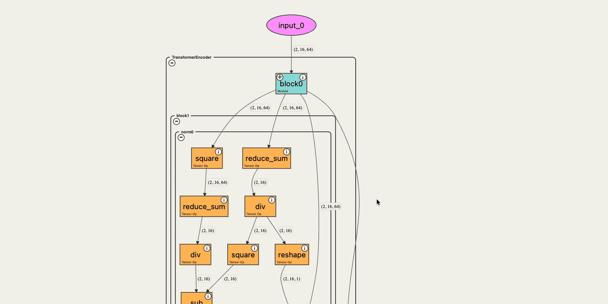
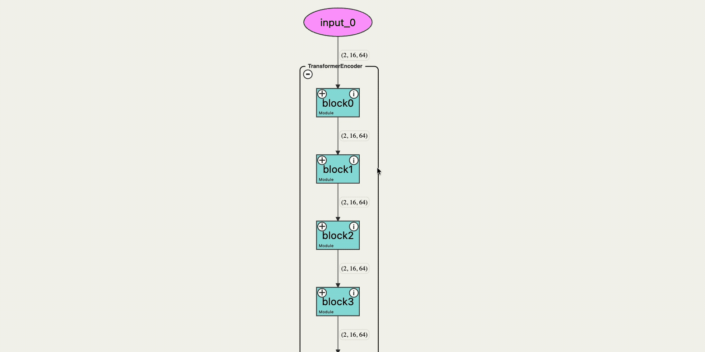
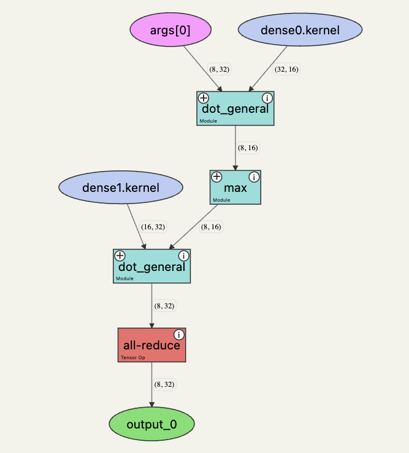
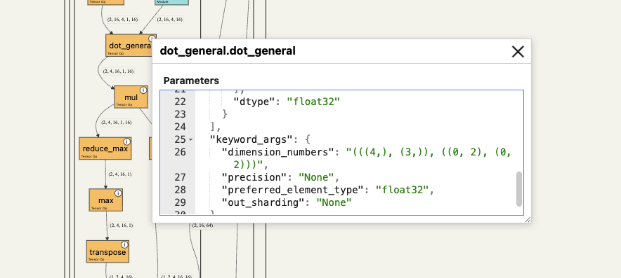

# jaxviz

An interactive tool to visualize the forward pass of a JAX model directly in a
notebook—with a single function call. JAXViz shows both the model as you wrote
it and the compiled program that runs on each device, and can export the
visualization as HTML, PNG, or SVG.

## ✨ Features

### Interactive graph with drag and zoom support



--------

### Collapsible graph for hierarchical modules



--------

### Global and per-device (compiled) program views

The **global view** shows the model as written: your operations, your module
hierarchy, and whole tensor shapes. The **per-device view** shows the compiled
program that actually runs on one device — the shapes each device works with and
compiler-inserted communication such as `all-reduce`.



--------

### Click nodes to inspect arguments



--------

## Examples

Find several examples viewable in the browser [here](https://sachinhosmani.github.io/jaxviz/)

## ⚙️ Usage

Install from source:

```bash
python -m pip install -e .
```

Flax and Equinox are optional dependencies used by the included examples:

```bash
python -m pip install flax equinox
```

Run from a web-based notebook such as Jupyter, Google Colab, Kaggle, or a VSCode
notebook:

```python
import jax.numpy as jnp

from jaxviz import trace_model


def model(x):
    weights = jnp.ones((8, 16))
    return jnp.tanh(x @ weights)


inputs = jnp.ones((4, 8))

# Trace the logical/global program.
trace_model(model, inputs, view="global")
```

For a sharded model, activate its mesh and request the per-device view:

```python
with jax.set_mesh(mesh):
    model = create_sharded_model()
    inputs = create_sharded_inputs()
    trace_model(model, inputs, view="per_device")
```

Complete runnable distributed examples are available under [`examples/`](examples/).

## API: `trace_model`

```python
trace_model(
    fn,
    *example_args,
    view="global",
    collapse_modules_after_depth=1,
    height=800,
    width=None,
    export_format=None,
    export_path=None,
    show_constants=False,
    return_html=False,
)
```

| Parameter | Type | Default value | Category | Description |
| --- | --- | --- | --- | --- |
| `fn` | `Callable` | — | Tracing | JAX-traceable function or supported module to visualize. |
| `*example_args` | `Any` | — | Tracing | Example input arrays or pytrees used to trace the program. |
| `view` | `str` | `"global"` | Tracing | Program view. `"global"` is the model as written, with your module hierarchy. `"per_device"` is the compiled program for one device, with collectives and expandable fused kernels but no module hierarchy — trace under a mesh so there is sharding for the compiler to act on. |
| `collapse_modules_after_depth` | `int` | `1` | Visual | Depth at which nested modules are initially collapsed; containers remain interactively expandable. Ignored in the per-device view, whose containers are fused kernels and always start collapsed. |
| `height` | `int \| str` | `800` | Visual | Canvas height in pixels or as a CSS value. |
| `width` | `int \| str` | `None` | Visual | Canvas width in pixels or as a CSS value; defaults to the available width. |
| `export_format` | `str` | `None` | Export | Optional format: `"png"`, `"svg"`, or `"html"`. Otherwise the graph is displayed in the notebook. |
| `export_path` | `str` | `None` | Export | Custom path for HTML export. |
| `show_constants` | `bool` | `False` | Visual | Show scalar and literal constant nodes. Global view only. |
| `return_html` | `bool` | `False` | Export | Return embeddable graph HTML instead of displaying it. |
